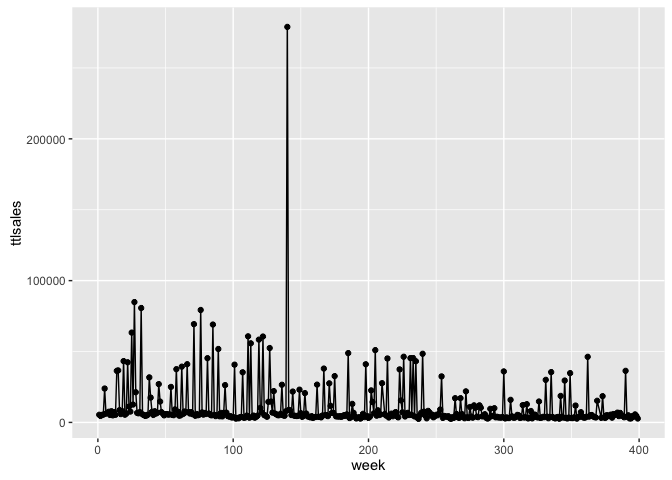
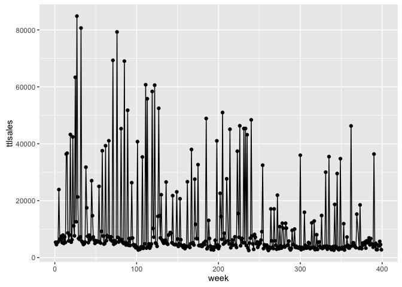
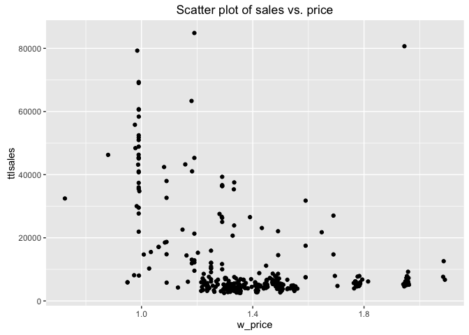
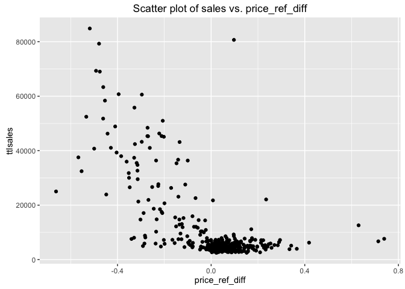
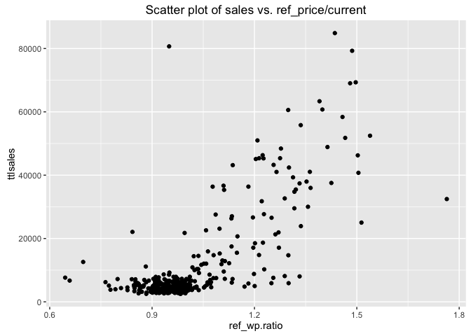
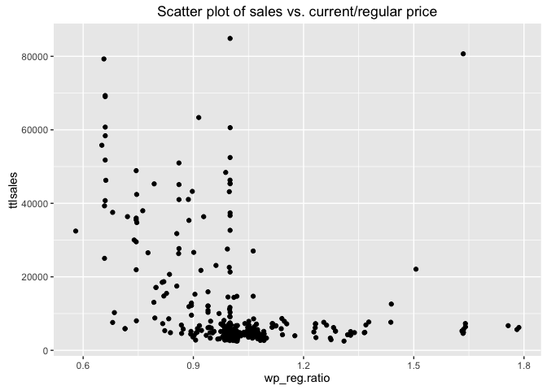
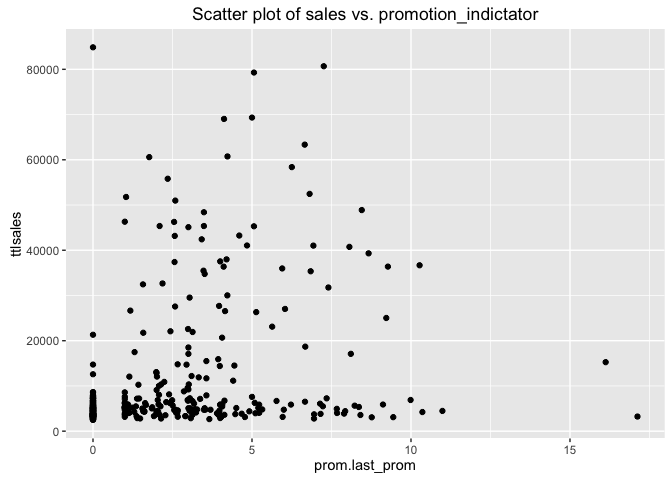

# Retail Scanner Data Prediction - Example Category: Frozen Juice
Fu-Chi Shih  
Summary:      
This document demonstrates some data analysis work we conducted on the Dominick's Database provided by James M. Kilts Center, University of Chicago Booth School of Business (https://research.chicagobooth.edu/kilts/marketing-databases/dominicks).    

The Dominick's database covers store-level scanner data collected at Dominick's Finer Foods over a period of more than seven years. Our goal is to build a model that can describe the relationship between the price, promotion, and sales of a sub-category or a product.     

Following is a step-by-step analysis for Frozen Juice category, including data cleaning, data aggregation, features prepartion, modelling, and model evaluations.   

*A detailed description of the functions we created by ourselves is listed in another document - Func_AggSales.md     

Contributors: Kevin Li, Fu-Chi Shih, Xueqi Wang, Prof. Candance Yano


### Data Cleaning and Preparations

Load relevant package and functions we defined by ourselves into the environment. 

```r
library(knitr)
knit('./Func_AggSales.Rmd', tangle=TRUE)
source('./Func_AggSales.R')
```

#### **1. Read and transform UPC(Universal Product Code) file**
The original upc file contains other information. We use our function ``readupc()`` to clean the upc file. After cleaning, we see that there are 175 products in frozen juice category.

```r
p<-"~/Documents/Codes/Pricing_Project/Data/csv-data/frozenjuice/upcfrj.csv"
frj_upc<-readupc(p)
head(frj_upc)
```

```
##          upc                        des
## 1 1110000139 FLORIDA GOLD VALENCI 12 OZ
## 2 1110000390 FLORIDAGOLD OLD FASH 12 OZ
## 3 1110000391 FLORIDAGOLD PULP FRE 12 OZ
## 4 1110000550 ~FLORIDA GOLD ORANGE 64 OZ
## 5 1450000124 DEAN FOODS RED RASPB 10 OZ
## 6 2080006311 SPEAS PARENTS CHOICE 12 OZ
```

```r
nrow(frj_upc)
```

```
## [1] 175
```
  
#### **2. Load the raw sales data**
Here is a glimpse of how raw data looks like:

```r
frj<-read.csv("~/Documents/Codes/Pricing_Project/Data/csv-data/frozenjuice/wfrj.csv") 
head(frj)
```

```
##   STORE        UPC WEEK MOVE QTY PRICE SALE PROFIT OK
## 1     2 1110000139    1   14   1  1.79       43.18  1
## 2     2 1110000139    2   48   1  1.79       43.18  1
## 3     2 1110000139    3  156   1  1.29    B  21.16  1
## 4     2 1110000139    4    4   1  1.29    B  22.17  1
## 5     2 1110000139    5   51   1  1.79       43.91  1
## 6     2 1110000139    6  145   1  1.29    B  22.17  1
```
Dominick's will sometimes bundle products (E.g., 3 cans of tomato soup for $2). In such occasion, the ``QTY`` variable will indicate the size of the bundle (E.g., 3), the ``PRICE`` will reflect the total price of the bundle (E.g., $2), but ``MOVE`` will reflect the number of actual item sold, not the number of bundles. Hence, to compute total dollar sales, we use the following calculation: ``SALES`` = ``PRICE`` * ``MOVE`` / ``QTY``.

#### **3. Clean and compute new variables**
We use functions ``clean()`` and ``process_data()`` to prepare our dataset for later analysis. Now our dataset contains only valid sales (``ok``= 1) entries, and we have new variables: ``sales``, ``unit_price``(price per unit), and ``prom`` (a binary variable indicating whether the product was promoted).

```r
frj<-clean(frj)  
frj<-process_data(frj,frj_upc)
head(frj)
```

```
##          upc store week move qty price sale profit ok
## 1 1110000139     2    1   14   1  1.79       43.18  1
## 2 1110000139     2    2   48   1  1.79       43.18  1
## 3 1110000139     2    3  156   1  1.29    B  21.16  1
## 4 1110000139     2    4    4   1  1.29    B  22.17  1
## 5 1110000139     2    5   51   1  1.79       43.91  1
## 6 1110000139     2    6  145   1  1.29    B  22.17  1
##                          des  sales unit_price prom
## 1 FLORIDA GOLD VALENCI 12 OZ  25.06       1.79    0
## 2 FLORIDA GOLD VALENCI 12 OZ  85.92       1.79    0
## 3 FLORIDA GOLD VALENCI 12 OZ 201.24       1.29    1
## 4 FLORIDA GOLD VALENCI 12 OZ   5.16       1.29    1
## 5 FLORIDA GOLD VALENCI 12 OZ  91.29       1.79    0
## 6 FLORIDA GOLD VALENCI 12 OZ 187.05       1.29    1
```

#### **4. Compute product popularity**
To understand what are most popular products among frozen juice category, we use function ``agg()`` to aggregate sales for each product. This table can help us select the most popular product and build models upon it.


```r
frj_agg<-agg(frj,frj_upc) 
frj_agg<-prom_count(frj,frj_agg)
head(frj_agg)
```

```
##          upc   sales                        des        pct rank prom_freq
## 1 3828190029 7627822 HH ORANGE JUICE CONC 12 OZ 0.10723646    1 0.1930868
## 2 4850000145 4520098 TROP SB ORANGE JUICE 12 OZ 0.06354623    2 0.2700966
## 3 2500002519 3840911      MM ORANGE JUICE 12 OZ 0.05399781    3 0.2051971
## 4 4850000225 2414856 TROP SB HOME STYLE O 12 OZ 0.03394949    4 0.2773377
## 5 3828190021 2131603      DOM APPLE JUICE 12 OZ 0.02996735    5 0.1427718
## 6 1110000139 2034101 FLORIDA GOLD VALENCI 12 OZ 0.02859660    6 0.2290648
```

The Top15 products account for about 50% sales in frozen juice category.

```r
sum(frj_agg$pct[c(1:15)])
```

```
## [1] 0.4953958
```

#### **5. Compute store-weighted price for each product**
Back to our sales data. Remember, the original sales data is store-level and collected weekly. Here we use function ``sku_ttl()`` to compute store-weighted price for each product in each week. This new variable ``w_price`` can help us predict total sales of each product from all stores.

```r
frj_ttl<-sku_ttl(frj)
head(frj_ttl)
```

```
## Source: local data frame [6 x 7]
## Groups: upc [1]
## 
##          upc  week ttlsales prom_n store_n ttlmv  w_price
##        (dbl) (int)    (dbl)  (dbl)   (int) (int)    (dbl)
## 1 1110000139     1  2458.80      0      70  1506 1.632669
## 2 1110000139     2  7805.20      0      69  4698 1.661388
## 3 1110000139     3 24744.78     71      71 19182 1.290000
## 4 1110000139     4  4333.11     73      73  3359 1.290000
## 5 1110000139     5  5868.65      0      73  3535 1.660156
## 6 1110000139     6 17325.99     68      68 13431 1.290000
```

### Building Models 

#### **1. Build the first model**
We want to find factors that can best predict sales. Here, we pick up the 2nd most popular product - TROP SB ORANGE JUICE to build our first model. Below is a time series plot.


```r
i=2
tempfrj<-sub_sku(frj_ttl,frj_agg,i)
ggplot(tempfrj,aes(x=week,y=ttlsales)) + geom_line() + geom_point()
```

<!-- -->

There seems to be an outlier around week 140. Later, we would examine what happened in this week, but at this moment, we will remove this extreme value so that we can have a closer look of the pattern across all 400 weeks. 


```r
tempfrj<-subset(tempfrj, ttlsales<200000) 
ggplot(tempfrj,aes(x=week,y=ttlsales)) + geom_line() + geom_point()
```

<!-- -->

After moving the outlier, we have a clearer time series plot. The sales fluctuated a lot. We want to find the factors causing this fluctuation.
      
Next, we plot a scatter plot to examine the relationship between ``w_pric`` and ``sales``. 

```r
ggplot(tempfrj, aes(x=w_price, y=ttlsales)) + geom_point() + ggtitle("Scatter plot of sales vs. price")
```

<!-- -->

Overall , price and sales is negatively correlated. But, the relationship doesn't seem to be quite linear. Therefore, we try two models: 1) simple linear regression and 2) adding polynomial term to price.

**1) Simple Linear Regression Model**

```r
fit<-lm(ttlsales ~ w_price, data = tempfrj)
summary(fit)
```

```
## 
## Call:
## lm(formula = ttlsales ~ w_price, data = tempfrj)
## 
## Residuals:
##    Min     1Q Median     3Q    Max 
## -16090  -8191  -4482   4148  84037 
## 
## Coefficients:
##             Estimate Std. Error t value            Pr(>|t|)    
## (Intercept)    46151       3859  11.960 <0.0000000000000002 ***
## w_price       -25451       2736  -9.303 <0.0000000000000002 ***
## ---
## Signif. codes:  0 '***' 0.001 '**' 0.01 '*' 0.05 '.' 0.1 ' ' 1
## 
## Residual standard error: 12880 on 392 degrees of freedom
## Multiple R-squared:  0.1808,	Adjusted R-squared:  0.1788 
## F-statistic: 86.54 on 1 and 392 DF,  p-value: < 0.00000000000000022
```

We use our function ``cv()`` to apply 10-folds cross validation to the data and then compute the R-squared value for all folds. 

```r
cv_result<-cv(fit)
```


```r
print(cv_result)
```

```
## [1] 0.169
```
The R-squared 0.169 was pretty small, which means the model could only explain about 17% variance of the data.

**2) Polynomial Regression Model**

```r
fit<-lm(ttlsales ~ w_price + I(w_price^2), data = tempfrj)
summary(fit)
```

```
## 
## Call:
## lm(formula = ttlsales ~ w_price + I(w_price^2), data = tempfrj)
## 
## Residuals:
##    Min     1Q Median     3Q    Max 
## -34074  -4880  -2611   1903  70355 
## 
## Coefficients:
##              Estimate Std. Error t value            Pr(>|t|)    
## (Intercept)    212929      13307    16.0 <0.0000000000000002 ***
## w_price       -260132      18307   -14.2 <0.0000000000000002 ***
## I(w_price^2)    80185       6206    12.9 <0.0000000000000002 ***
## ---
## Signif. codes:  0 '***' 0.001 '**' 0.01 '*' 0.05 '.' 0.1 ' ' 1
## 
## Residual standard error: 10800 on 391 degrees of freedom
## Multiple R-squared:  0.426,	Adjusted R-squared:  0.423 
## F-statistic:  145 on 2 and 391 DF,  p-value: <0.0000000000000002
```


```r
cv_result<-cv(fit)
```


```r
print(cv_result)
```

```
## [1] 0.413
```

The R-squared value of 0.413 is much higher than previous one. It shows that the polynomial regression model performes much better than simple linear regression model. 

#### **2. Include other predictors to the model**
In previous analysis, we see that using solely price as the predictor only captures 41% variance of the data. We believe there were other factors affecting the sales trend and thus compute the following new predictors:    
1) ``promfreq``: promotion frequency for the past 4 weeks   
2) ``reg_price``: the most common price for the past 12 weeks   
3) ``reference_p``: reference price of current week = reference price of the previous week * alpha + actual price of the previous week * (1 - alpha)    
alpha is a numeric number between 0 ~ 1.   
4) ``price_ref_diff``: the difference between weighted price and difference price (``w_price`` - ``reference_p``)   
5) ``ref_wp.ratio``: ``reference_p`` / ``w_price``   
6) ``wp_reg.ratio``: ``w_price`` / ``reg_price``    
7) ``prom.last_prom``: A compounded promotion factor. If the current week has promotion, this variable represents the average period of time since last promotion. If the current week has no promotion, the variable is encoded as 0.   


```r
tempfrj<-prom_freq(period=4, tempfrj)  # compute average promotion frequency
tempfrj<-subset(tempfrj, ttlsales<200000) # exclude outlier
```


```r
regfrj<-find_reg_price(frj, frj_agg, i, period=12) # find regular price 
tempfrj<-merge(tempfrj, regfrj, by="week") # combine all predictors
```


```r
tempfrj<-reference_price(tempfrj, alpha = 0.6) 
# compute reference price, reference price/weighted price, and weighted price/regular price
```


```r
tempfrj<-last_prom(frj, frj_agg,tempfrj, i)  # compute the average period of time since last promotion 
tempfrj<-promotion_factor(tempfrj) # compute the compounded promotion factor
```


```r
cols<-c("week","upc","ttlsales","prom_n","w_price","promfreq","reg_price","reference_p","price_ref_diff","ref_wp.ratio","wp_reg.ratio","prom.last_prom")
head(tempfrj[,cols],15)
```

```
##    week        upc ttlsales prom_n w_price promfreq reg_price reference_p
## 1     1 4850000145     5379      0    1.78       NA        NA        1.78
## 2     2 4850000145     4572      0    1.77       NA        NA        1.78
## 3     3 4850000145     5302      0    1.78       NA        NA        1.78
## 4     4 4850000145     5466      0    1.79     0.00        NA        1.78
## 5     5 4850000145    23900     73    1.33     0.25        NA        1.78
## 6     6 4850000145     6157      0    1.81     0.25        NA        1.60
## 7     7 4850000145     6780      0    1.79     0.25        NA        1.69
## 8     8 4850000145     7502      0    1.59     0.25        NA        1.73
## 9     9 4850000145     5268      0    1.78     0.00        NA        1.67
## 10   10 4850000145     7887      0    1.78     0.00        NA        1.72
## 11   11 4850000145     4985      0    1.45     0.00        NA        1.74
## 12   12 4850000145     7259      0    1.46     0.00      1.79        1.63
## 13   13 4850000145     5348      0    1.47     0.00      1.79        1.56
## 14   14 4850000145    36382      0    1.29     0.00      1.79        1.53
## 15   15 4850000145    36676     74    1.29     0.25      1.29        1.43
##    price_ref_diff ref_wp.ratio wp_reg.ratio prom.last_prom
## 1         0.00000        1.000           NA             NA
## 2        -0.00585        1.003           NA             NA
## 3        -0.00181        1.001           NA             NA
## 4         0.00897        0.995           NA             NA
## 5        -0.44801        1.336           NA             NA
## 6         0.21286        0.883           NA             NA
## 7         0.10671        0.941           NA             NA
## 8        -0.13966        1.088           NA             NA
## 9         0.10787        0.939           NA             NA
## 10        0.06631        0.963           NA             NA
## 11       -0.29131        1.201           NA             NA
## 12       -0.16541        1.113        0.817           7.35
## 13       -0.08913        1.061        0.822           8.36
## 14       -0.23513        1.182        0.721           9.27
## 15       -0.14108        1.109        1.000          10.27
```

**Some first few weeks have NAs** : these are initial weeks used to compute variables ``prom.last_prom``, ``reg_price``, and ``promfreq``.

#### **3. Explore correlations between new variables**
Before diving into a more complex model, we made a few scatter plots of variaous variables and sales to examine their hidden relationships.

**1) multiple time series plot of ``ttlsales`` (total sales), ``w_price`` (weighted price), ``n_prom`` (number of store running promotion)**  

```r
multi_tsplot(tempfrj)
```

<!-- -->

**2) time series plot of price and reference price**

```r
Rprice_plot(tempfrj)
```

<!-- -->

**3) scatter plot of price & reference price difference and sales**

```r
ggplot(tempfrj, aes(x=price_ref_diff, y=ttlsales)) + geom_point() + ggtitle("Scatter plot of sales vs. price_ref_diff")
```

<!-- -->

**4) scatter plot of ref/current price ratio and sales**

```r
ggplot(tempfrj, aes(x=ref_wp.ratio, y=ttlsales)) + geom_point() + ggtitle("Scatter plot of sales vs. ref_price/current")
```

<!-- -->

**5) scatter plot of current/regular price ratio and sales**

```r
ggplot(tempfrj, aes(x=wp_reg.ratio, y=ttlsales)) + geom_point() + ggtitle("Scatter plot of sales vs. current/regular price")
```

<!-- -->

**6) scatter plot of time since last promotion and sales**

```r
ggplot(tempfrj, aes(x=prom.last_prom, y=ttlsales)) + geom_point() + ggtitle("Scatter plot of sales vs. promotion_indictator")
```

<!-- -->

From scatter plots, we see that a few variables have strong correlation with sales response. However, before include new variables into our linear model, we need to make sure the predictors we include don't have strong correlations with each other.

```r
cols<-c("ttlsales","price_ref_diff", "promfreq","w_price","reference_p", "wp_reg.ratio","ref_wp.ratio","prom.last_prom")
pairs.panels(tempfrj[cols])
```

<!-- -->

The following paired variables have strong correlations with each other. We need to be careful not to use them in the same model.    
1) ``w_price`` and ``promfreq``, 2) ``w_price`` and ``reference_p``, 3)  ``wp_reg.ratio`` and ``ref_wp.ratio``, 4) ``w_price`` and ``wp_reg.ratio``, 5) ``w_price`` and ``ref_wp.ratio``

#### **4. Add new predictors and evaluate different models**
Now, we fit different models to our data, and use 10-fold cross validation to compute each model's r-squared value.    
To begin with, we created an empty table so that we can compare different models more easily.

```r
df<-data.frame(
  Models = c("Response", "Predictor1", "Predictor2","Predictor3", "cv_result-1", "cv_result-2"), 
  Model_1 = c("Sales", "w_price", "prom.last_prom","/", "NA","NA"),
  Model_2 = c("Sales", "price_ref_diff", "reference_p", "prom.last_prom", "NA","NA"),
  Model_3 = c("Sales", "ref_wp.ratio", "reference_p", "prom.last_prom", "NA", "NA"),
  Model_4 = c("Sales", "wp_reg.ratio", "reference_p", "prom.last_prom", "NA", "NA"),
  stringsAsFactors = FALSE
  )
```

**1) Model_11**        
Response: ``ttlsales``    
Predictors: ``w_price``, ``prom.last_prom``

```r
fit_11<-lm(ttlsales ~ w_price + prom.last_prom, data=tempfrj)
cv_result_11<-cv(fit_11)
df[5,"Model_1"]<-round(cv_result_11, 3)
```

**2) Model_12**        
Response: ``ttlsales``    
Predictors: ``w_price``, ``w_price^2``, ``prom.last_prom``, ``prom.last_prom^2``

```r
fit_12<-lm(ttlsales ~ w_price + I(w_price^2) + prom.last_prom + I(prom.last_prom^2), data=tempfrj)
cv_result_12<-cv(fit_12)
df[6,"Model_1"]<-round(cv_result_12, 3)
```


**3) Model_21**     
Response: ``ttlsales``    
Predictors: ``reference_p``, ``prom.last_prom``, ``price_ref_diff``

```r
fit_21<-fit<-lm(ttlsales ~ reference_p + prom.last_prom + price_ref_diff, data=tempfrj)
cv_result_21<-cv(fit_21)
df[5,"Model_2"]<-round(cv_result_21, 3)
```

**4) Model_22**     
Response: ``ttlsales``    
Predictors: ``reference_p``, ``reference_p^2``, ``prom.last_prom``, ``prom.last_prom^2``,  ``price_ref_diff``

```r
fit_22<-lm(ttlsales ~ reference_p + I(reference_p^2) + prom.last_prom + I(prom.last_prom^2) + price_ref_diff, data=tempfrj)
cv_result_22<-cv(fit_22)
df[6,"Model_2"]<-round(cv_result_22, 3)
```


**5) Model_31**     
Response: ``ttlsales``    
Predictors: ``ref_wp.ratio``, ``reference_p``, ``prom.last_prom``

```r
fit_31<-fit<-lm(ttlsales ~ ref_wp.ratio + reference_p + prom.last_prom, data=tempfrj)
cv_result_31<-cv(fit_31)
df[5,"Model_3"]<-round(cv_result_31, 3)
```

**6) Model_32**     
Response: ``ttlsales``    
Predictors: ``ref_wp.ratio``, ``reference_p``, ``reference_p^2``, ``prom.last_prom``, ``prom.last_prom^2``

```r
fit_32<-fit<-lm(ttlsales ~ ref_wp.ratio + reference_p + I(reference_p^2) + prom.last_prom + I(prom.last_prom^2), data=tempfrj)
cv_result_32<-cv(fit_32)
df[6,"Model_3"]<-round(cv_result_32, 3)
```

**7) Model_41**    
Response: ``ttlsales``    
Predictors: ``wp_reg.ratio``, ``reference_p``, ``prom.last_prom``

```r
fit_41<-fit<-lm(ttlsales ~ wp_reg.ratio + reference_p + prom.last_prom, data=tempfrj)
cv_result_41<-cv(fit_41)
df[5,"Model_4"]<-round(cv_result_41, 3)
```

**8) Model_42**      
Response: ``ttlsales``    
Predictors: ``wp_reg.ratio``, ``reference_p``, ``reference_p^2``, ``prom.last_prom``, ``prom.last_prom^2``

```r
fit_42<-fit<-lm(ttlsales ~ wp_reg.ratio + reference_p + I(reference_p^2) + prom.last_prom + I(prom.last_prom^2), data=tempfrj)
cv_result_42<-cv(fit_42)
df[6,"Model_4"]<-round(cv_result_42, 3)
```


```r
print(df)
```

```
##        Models        Model_1        Model_2        Model_3        Model_4
## 1    Response          Sales          Sales          Sales          Sales
## 2  Predictor1        w_price price_ref_diff   ref_wp.ratio   wp_reg.ratio
## 3  Predictor2 prom.last_prom    reference_p    reference_p    reference_p
## 4  Predictor3              / prom.last_prom prom.last_prom prom.last_prom
## 5 cv_result-1          0.215          0.454          0.558          0.139
## 6 cv_result-2          0.447          0.455          0.559          0.156
```
``cv-result-1``: r-squared value from 10-fold cross validation ; no polynominal terms in the model    
``cv-result-2``: r-squared value from 10-fold cross validation ; adding polynominal terms into the model (e.g. ``reference_p^2``)

### **Conclusions**    
Among all, model_31 explains the data best (though model_32 has slightly higher r-squared value, the principal of parsimony tells us that model_31 is preferable.)   

```r
summary(fit_31)
```

```
## 
## Call:
## lm(formula = ttlsales ~ ref_wp.ratio + reference_p + prom.last_prom, 
##     data = tempfrj)
## 
## Residuals:
##    Min     1Q Median     3Q    Max 
## -30212  -4438  -1603   2341  72858 
## 
## Coefficients:
##                Estimate Std. Error t value            Pr(>|t|)    
## (Intercept)      -61495       4520  -13.60 <0.0000000000000002 ***
## ref_wp.ratio      69706       3389   20.57 <0.0000000000000002 ***
## reference_p         631       2621    0.24                0.81    
## prom.last_prom      266        188    1.42                0.16    
## ---
## Signif. codes:  0 '***' 0.001 '**' 0.01 '*' 0.05 '.' 0.1 ' ' 1
## 
## Residual standard error: 9320 on 379 degrees of freedom
##   (11 observations deleted due to missingness)
## Multiple R-squared:  0.583,	Adjusted R-squared:  0.579 
## F-statistic:  176 on 3 and 379 DF,  p-value: <0.0000000000000002
```
The coefficient and siginificant test shows that, **as the ratio of reference price/current weighted price (``ref_wp.ratio``) goes up, the sales goes up too.** This actually tells us how customers perceive pricing. There is often a reference price in customer's mind (that is how much consumers expect to pay for a good in relation to other competitors and the previously advertised price). The model_31 tells us that the ratio of reference price / current price (just like discount porpotion) tends to drive customers' buying behavior.    

It's interesting to note that in model_21, where we use ``price_ref_diff`` as one of the predictors, the model isn't as good as model_31. It implies that when evaluating price and making purchaing decisions, customers tend to compute the ratio of reference price and current price, instead of the actual price difference. 
