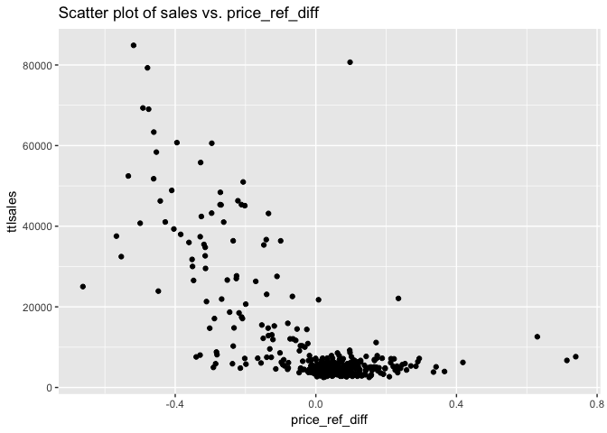

# Summary
Fu-Chi Shih  
This repositoy demonstrates some data analysis work we conducted on the **Dominick's scanner data**.The database covers store-level scanner data collected at Dominick's Finer Foods over a period of more than seven years (1989-1997). Our goal is to build a model that can describe the relationship between price, promotion, and sales of different products.   

Here is a summary of graphs and models we built to predict sales of frozen juice. A more detailed step-by-step analysis is documented in the file Modelling_AggSales.md. All functions we designed on our own is listed in the file Func_AggSales.md. 

**Acknowledgement**: Thanks are given to James M. Kilts Center of Marketing at the Graduate School of Business, University of Chicago, for making the Dominick’s Finer Foods data available. (https://research.chicagobooth.edu/kilts/marketing-databases/dominicks)


  


### Using weighted price to predict sales 
We want to find factors that can best predict sales. As an example, we select data of the 2nd popular product - Tropicana Orange Juice,12OZ for later analysis. Below is a time series plot of its sales.


```r
i=2
tempfrj<-sub_sku(frj_ttl,frj_agg,i)
tempfrj<-subset(tempfrj, ttlsales<200000) # delete outlier
ggplot(tempfrj,aes(x=week,y=ttlsales)) + geom_line() + geom_point() + ggtitle("Weekly sales of Tropicana Orange Juice")
```

<!-- -->

The sales fluctuated a lot.    
Next, we plot a scatter plot to examine the relationship between ``w_pric`` (store-weighted price) and ``sales``. 

```r
ggplot(tempfrj, aes(x=w_price, y=ttlsales)) + geom_point() + ggtitle("Scatter plot of sales vs. price")
```

<!-- -->

Overall , price and sales is negatively correlated. But, the relationship doesn't seem to be quite linear. Therefore, we try two models: 1) simple linear regression and 2) adding polynomial term to the price.

##### 1) Simple Linear Regression Model

```r
fit<-lm(ttlsales ~ w_price, data = tempfrj)
summary(fit)
```

```
## 
## Call:
## lm(formula = ttlsales ~ w_price, data = tempfrj)
## 
## Residuals:
##    Min     1Q Median     3Q    Max 
## -16090  -8191  -4482   4148  84037 
## 
## Coefficients:
##             Estimate Std. Error t value            Pr(>|t|)    
## (Intercept)    46151       3859  11.960 <0.0000000000000002 ***
## w_price       -25451       2736  -9.303 <0.0000000000000002 ***
## ---
## Signif. codes:  0 '***' 0.001 '**' 0.01 '*' 0.05 '.' 0.1 ' ' 1
## 
## Residual standard error: 12880 on 392 degrees of freedom
## Multiple R-squared:  0.1808,	Adjusted R-squared:  0.1788 
## F-statistic: 86.54 on 1 and 392 DF,  p-value: < 0.00000000000000022
```

We use our function ``cv()`` to apply 10-folds cross validation to the data and then compute the R-squared value for all folds. 

```r
cv_result<-cv(fit)
```


```r
print(cv_result)
```

```
## [1] 0.169
```
The R-squared 0.169 was pretty small, which means that the model could only explain 17% variance of the data.

##### 2) Polynomial Regression Model

```r
fit<-lm(ttlsales ~ w_price + I(w_price^2), data = tempfrj)
summary(fit)
```

```
## 
## Call:
## lm(formula = ttlsales ~ w_price + I(w_price^2), data = tempfrj)
## 
## Residuals:
##    Min     1Q Median     3Q    Max 
## -34074  -4880  -2611   1903  70355 
## 
## Coefficients:
##              Estimate Std. Error t value            Pr(>|t|)    
## (Intercept)    212929      13307    16.0 <0.0000000000000002 ***
## w_price       -260132      18307   -14.2 <0.0000000000000002 ***
## I(w_price^2)    80185       6206    12.9 <0.0000000000000002 ***
## ---
## Signif. codes:  0 '***' 0.001 '**' 0.01 '*' 0.05 '.' 0.1 ' ' 1
## 
## Residual standard error: 10800 on 391 degrees of freedom
## Multiple R-squared:  0.426,	Adjusted R-squared:  0.423 
## F-statistic:  145 on 2 and 391 DF,  p-value: <0.0000000000000002
```


```r
cv_result<-cv(fit)
```


```r
print(cv_result)
```

```
## [1] 0.413
```

The R-squared value of 0.413 is much higher than 0.17. It shows that the polynomial regression model performes much better than simple linear regression model. 

### Include other predictors into the model 

#### 1. Compute new predictors
In previous analysis, we see that using weighted-price as predictor only captures 41% variance of the data. We believe there were other factors affecting the sales trend and thus compute the following new predictors:    
1) ``promfreq``: promotion frequency for the past 4 weeks   
2) ``reg_price``: the most common price for the past 12 weeks   
3) ``reference_p``: reference price of current week = reference price of the previous week * alpha + actual price of the previous week * (1 - alpha)    
alpha is a numeric number between 0 ~ 1.   
4) ``price_ref_diff``: the difference between weighted price and difference price (``w_price`` - ``reference_p``)   
5) ``ref_wp.ratio``: ``reference_p`` / ``w_price``   
6) ``wp_reg.ratio``: ``w_price`` / ``reg_price``    
7) ``prom.last_prom``: A compounded promotion factor. If the current week has promotion, this variable represents the average period of time since last promotion. If the current week has no promotion, the variable is encoded as 0.   


Example of all variables for first few weeks.

```
##    week        upc ttlsales prom_n w_price promfreq reg_price reference_p
## 15   15 4850000145    36676     74    1.29     0.25      1.29        1.43
## 16   16 4850000145     8650      0    1.47     0.25      1.29        1.37
## 17   17 4850000145     5881      0    1.47     0.25      1.29        1.41
## 18   18 4850000145     7907      0    1.48     0.25      1.29        1.44
## 19   19 4850000145    43252     75    1.16     0.25      1.29        1.45
## 20   20 4850000145     5413      0    1.44     0.25      1.45        1.34
##    price_ref_diff ref_wp.ratio wp_reg.ratio prom.last_prom
## 15        -0.1411        1.109        1.000           10.3
## 16         0.0972        0.934        1.141            0.0
## 17         0.0561        0.962        1.139            0.0
## 18         0.0445        0.970        1.148            0.0
## 19        -0.2964        1.256        0.897            4.6
## 20         0.1079        0.925        0.995            1.0
```

#### 2. Explore correlations between new variables
Before diving into a more complex model, we made a few scatter plots of variaous variables and sales to examine their hidden relationships.

**1) multiple time series plot of ``ttlsales`` (total sales), ``w_price`` (weighted price), ``n_prom`` (number of store running promotion)**  

```r
multi_tsplot(tempfrj)
```

<!-- -->

**2) time series plot of price and reference price**

```r
Rprice_plot(tempfrj)
```

<!-- -->

**3) scatter plot of price & reference price difference and sales**

```r
ggplot(tempfrj, aes(x=price_ref_diff, y=ttlsales)) + geom_point() + ggtitle("Scatter plot of sales vs. price_ref_diff")
```

<!-- -->

**4) scatter plot of ref/current price ratio and sales**

```r
ggplot(tempfrj, aes(x=ref_wp.ratio, y=ttlsales)) + geom_point() + ggtitle("Scatter plot of sales vs. ref_price/current")
```

<!-- -->

**5) scatter plot of current/regular price ratio and sales**

```r
ggplot(tempfrj, aes(x=wp_reg.ratio, y=ttlsales)) + geom_point() + ggtitle("Scatter plot of sales vs. current/regular price")
```

<!-- -->

**6) scatter plot of time since last promotion and sales**

```r
ggplot(tempfrj, aes(x=prom.last_prom, y=ttlsales)) + geom_point() + ggtitle("Scatter plot of sales vs. promotion_indictator")
```

<!-- -->

From scatter plots, we see that a few variables have strong correlation with sales response. However, before include new variables into our linear model, we need to make sure the predictors we include don't have strong correlations with each other.

```r
cols<-c("ttlsales","price_ref_diff", "promfreq","w_price","reference_p", "wp_reg.ratio","ref_wp.ratio","prom.last_prom")
pairs.panels(tempfrj[cols])
```

<!-- -->

The following paired variables have strong correlations with each other. We need to be careful not to use them in the same model.    
1) ``w_price`` and ``promfreq``, 2) ``w_price`` and ``reference_p``, 3)  ``wp_reg.ratio`` and ``ref_wp.ratio``, 4) ``w_price`` and ``wp_reg.ratio``, 5) ``w_price`` and ``ref_wp.ratio``

#### 3. Add new predictors and evaluate different models
Next, we will fit different models to our data, and use 10-fold cross validation to compute each model's r-squared value.    


**1) Model_1-1**        
Response: ``ttlsales``    
Predictors: ``w_price``, ``prom.last_prom``


**2) Model_1-2**        
Response: ``ttlsales``    
Predictors: ``w_price``, ``w_price^2``, ``prom.last_prom``, ``prom.last_prom^2``


**3) Model_2-1**     
Response: ``ttlsales``    
Predictors: ``reference_p``, ``prom.last_prom``, ``price_ref_diff``


**4) Model_2-2**     
Response: ``ttlsales``    
Predictors: ``reference_p``, ``reference_p^2``, ``prom.last_prom``, ``prom.last_prom^2``,  ``price_ref_diff``


**5) Model_3-1**     
Response: ``ttlsales``    
Predictors: ``ref_wp.ratio``, ``reference_p``, ``prom.last_prom``


**6) Model_3-2**     
Response: ``ttlsales``    
Predictors: ``ref_wp.ratio``, ``reference_p``, ``reference_p^2``, ``prom.last_prom``, ``prom.last_prom^2``


**7) Model_4-1**    
Response: ``ttlsales``    
Predictors: ``wp_reg.ratio``, ``reference_p``, ``prom.last_prom``


**8) Model_4-2**      
Response: ``ttlsales``    
Predictors: ``wp_reg.ratio``, ``reference_p``, ``reference_p^2``, ``prom.last_prom``, ``prom.last_prom^2``


**Below table shows r-squared values (using 10-fold cross validation) for all models**

```
##        Models        Model_1        Model_2        Model_3        Model_4
## 1    Response          Sales          Sales          Sales          Sales
## 2  Predictor1        w_price price_ref_diff   ref_wp.ratio   wp_reg.ratio
## 3  Predictor2 prom.last_prom    reference_p    reference_p    reference_p
## 4  Predictor3              / prom.last_prom prom.last_prom prom.last_prom
## 5 cv_result-1          0.215          0.454          0.558          0.139
## 6 cv_result-2          0.447          0.455          0.559          0.156
```
``cv-result-1``: r-squared value from 10-fold cross validation ; no polynominal terms in the model    
``cv-result-2``: r-squared value from 10-fold cross validation ; adding polynominal terms into the model (e.g. ``reference_p^2``)

#### 4.Conclusions    
Among all, model_3-1 explains the data best (though model_3-2 has slightly higher r-squared value, the principal of parsimony tells us that model_3-1 is preferable.)   

```r
summary(fit_31)
```

```
## 
## Call:
## lm(formula = ttlsales ~ ref_wp.ratio + reference_p + prom.last_prom, 
##     data = tempfrj)
## 
## Residuals:
##    Min     1Q Median     3Q    Max 
## -30212  -4438  -1603   2341  72858 
## 
## Coefficients:
##                Estimate Std. Error t value            Pr(>|t|)    
## (Intercept)      -61495       4520  -13.60 <0.0000000000000002 ***
## ref_wp.ratio      69706       3389   20.57 <0.0000000000000002 ***
## reference_p         631       2621    0.24                0.81    
## prom.last_prom      266        188    1.42                0.16    
## ---
## Signif. codes:  0 '***' 0.001 '**' 0.01 '*' 0.05 '.' 0.1 ' ' 1
## 
## Residual standard error: 9320 on 379 degrees of freedom
##   (11 observations deleted due to missingness)
## Multiple R-squared:  0.583,	Adjusted R-squared:  0.579 
## F-statistic:  176 on 3 and 379 DF,  p-value: <0.0000000000000002
```
The coefficient and siginificant test show that, **as the ratio of reference price/current weighted price (``ref_wp.ratio``) goes up, the sales goes up too.** This actually tells us how customers perceive prices. There is often a reference price in customer's mind (that is how much consumers expect to pay for a good in relation to other competitors and the previously advertised price). The model_3-1 tells us that the ratio of reference price / current price (just like discount porpotion) tends to drive customers' buying behavior.    

It's interesting to note that in model_2-1, where we use ``price_ref_diff`` as one of the predictors, the model isn't as good as model_3-1. It implies that when evaluating price and making purchaing decisions, customers tend to compute the ratio of reference price and current price, instead of the actual price difference. 

